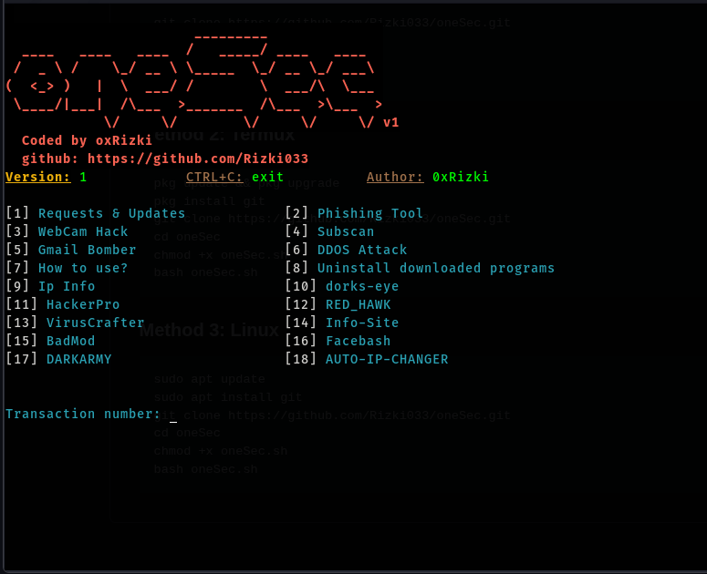

Author: oxRizki

# Version 1 🛡️



## Features
-  18+ Security Tools Integration
-  Automated Installation & Setup
-  Colorful CLI Interface
-  Easy Tool Management
-  One-Command Execution

## Operating System Requirements
works on any of the following operating systems:
• Android (Using the Termux App)
• Linux (Debian Based Systems)
• Unix

## How to Install
### Method 1: Quick Install
```
git clone https://github.com/Rizki033/oneSec.git
cd oneSec
chmod +x oneSec.sh
bash oneSec.sh
```
### Method 2: Termux
```
pkg update && pkg upgrade
pkg install git
git clone https://github.com/Rizki033/oneSec.git
cd oneSec
chmod +x oneSec.sh
bash oneSec.sh
```
### Method 3: Linux
```
sudo apt update
sudo apt install git
git clone https://github.com/Rizki033/oneSec.git
cd oneSec
chmod +x oneSec.sh
bash oneSec.sh
```

